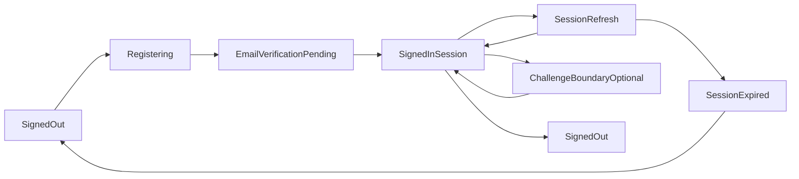

# Cross-App Auth State Diagram

## Notes
- `ChallengeBoundaryOptional` is an extension seam for biometric/MFA and is non-blocking in the starter.
- Session-refresh failure transitions to `SessionExpired` and then back to `SignedOut`.
